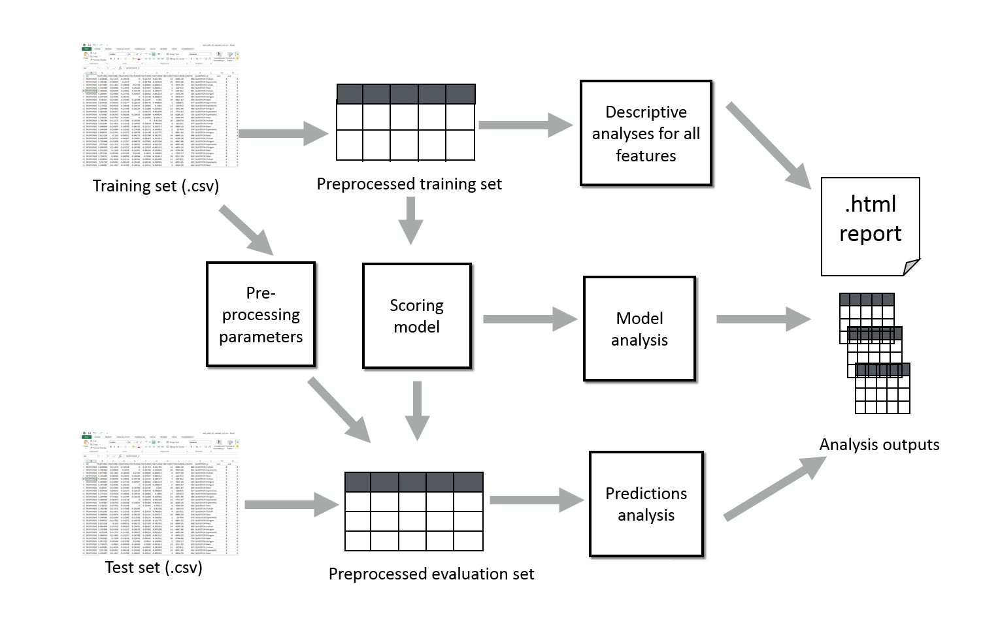

## Introduction

RSMTool is a python package which automates and combines in a single pipeline multiple analyses commonly conducted when building and evaluating scoring models for educational applications. RSMTool is designed as a platform which on one hand makes it simple to run multiple standard analyses using a single command but at the same time offers multiple customization opportunities for each step allowing the user to adapt the analyses to their purposes. 

The figure gives an overview of the main pipeline implemented in RSMTool:  

Specifically, RSMTool takes a feature file with numeric, non-sparse features and a human score as input and lets you try several different regression models (including Ridge, SVR, AdaBoost and Random Forest) to try and predict the human score from the features. The primary output of RSMTool is a comprehensive, customizable HTML statistical report that contains multiple analyses required for a comprehensive evaluation of an automated scoring model including feature descriptives, subgroup analyses, model statistics, as well as several different evaluation measures illustrating model efficacy. (See doc/rsmtool.pdf for further detail about the evaluations). 
The user can choose to run all the analyses or select a subset applicable to their particular study by changing the settings in the configuration file. Since the report is based on IPython notebooks, it can be easily customized. In addition, RSMTool explicitly provides support for adding custom notebooks to the report. 

Note that although the analyses included into the tool as well as wording of the report have been customized for automated scoring models, the tool can be used for any application where numeric feature values are mapped onto numeric label. 

RSMTool has two main use cases illustrated by the following examples:

* Use case 1: a researcher *has* a set of responses such as essays or recorded spoken responses which have already been assigned numeric scores. She also processed these responses and extracted a set of numeric features either using systems such as Coh-Metrix, TextEvaluator, OpenSmile or by manually creating a new set of features. 
She uses *RSMTool* to build a regression-based system which predicts the scores based on the extracted features using different types of regressions, to compute descriptive statistics for all features, to generate scores for a held-out evaluation set, and to obtain a comprehensive evaluation of system performance. While she could use `R`, `SPSS` or other tools to perform these analyses, `RSMTool` allows her to do so by running a single command. Furthermore, the analyses included into the tool highlight the issues that are commonly considered w need to be considered when building automated scoring models. She can then use the tool outputs for further exploratory analysis of her model. 

* Use case 2: A researcher *has* an automated scoring system for grading short responses that extracts the features and computes the score. He wants to evaluate the system performance using metrics commonly used in educational community but not always available in standard machine learning packages as well as to conduct additional analyses to evaluate system fairness and compare system performance to human-human agreement.
He *uses* RSMTool to set up customized evaluation report using a combination of existing and custom sections and then runs RSMEval to quickly produce a new report for each version of his system. 

RSMTool provides the following main scripts. The documentation for each of these tools is provided separately (see below). 

* `rsmtool` - the tool for training and evaluating scoring models as described in Use case 1

* `rsmeval` - the tool for evaluating predictions obtained from other systems as described in use case 2. 

* `rsmpredict` - the tool for generating new predictions based on an existing models. For researchers who are already using `rsmtool` to build scoring model, this tool allows generating predictions for new data using an existing model. 

* `rsmcompare` -  for comparing two `rsmtool` runs. This tool compares two models trained using `rsmtool`. It is most commonly used to compare model performance after adding new features.

## Installation

Currently, the best way to install RSMTool is by using the `conda` package manager. If you have the `conda` package manager already installed, you can skip straight to Step 2. 

1. To install the `conda` package manager, follow the instructions on [this page](http://conda.pydata.org/docs/install/quick.html).  

2. Create a new conda environment (say, `rsmtool`) and install the `rsmtool` conda package by running `conda create -n rsmtool -c desilinguist python=3.4 rsmtool`.

3. Activate this conda environment by running `source activate rsmtool`. You should now have all of the four tools above in your path.

4. From now on, you will need to activate this conda environment whenever you want to use RSMTool. This will ensure that the packages required by `rsmtool` will only be used when you want to run `rsmtool` experiments and will not affect other projects. 

Note that RSMTool only works with Python 3.4 and higher. 

## Example

You can try out RSMTool as follows:

1. Go to the `example/rsmtool` folder. This folder contains the training and test set features for a simple scoring system built to automatically score the responses from the [2012 Kaggle Automated Student Assessment Prize competition](https://www.kaggle.com/c/asap-aes). 
2. Make sure to activate the conda environment where you installed rsmtool (e.g., `source activate rsmtool`)
3. We first try the whole pipeline by running RSMTool: `rsmtool config.json`
4. Since no output directory was specfied, `rsmtool` will create the three output folders in the current directory: `figure`, `output`, and `report`. You can examine the HTML report `report/ASAP2_report.html`. It should look like [this](https://s3.amazonaws.com/sample-rsmtool-report/ASAP2_report.html).
5. Now we will use `rsmpredict` to re-generate the scores for the test set without re-training the model. We will store these new predictions in `predictions.csv`: go to `../rsmpredict` and run `rsmpredict config_rsmpredict.json predictions.csv`. The tool will create a new file called `predictions.csv` which contains the predictions. 
6. We will use `rsmeval` to evaluate these new predictions: go to `../rsmeval` and run `rsmeval config_rsmeval.json` .`rsmeval` will create the three output folders in the current directory: `figure`, `output`, and `report`. 
7. Finally, we will compare the two sets of predictions by running `RSMCompare`: go to `../rsmcompare` and run `rsmcompare config_rsmcompare.json`. The tool will create an `.html` report in the current directory since no output directory was specified. This report compare the analyses generated at steps (4) and (5). Note that since for `rsmeval` we used existing predictions, no information is available about feature distributions of model parameters. 

## Contributing

Contributions to RSMTool are very welcome. You can use the instructions below to get started on developing new features or functionality for RSMTool.

1. Pull the latest version of rsmtool from github and switch to the `master` branch. 

2. If you already have the `conda` package manager installed, skip to the next step. If you do not, follow the instructions on [this page](http://conda.pydata.org/docs/install/quick.html) to install `conda`. 

3. Create a new conda environment (say, `rsmtool`) and install the packages specified in the `conda_requirements.txt` file by running `conda create -n rsmtool -c desilinguist --file conda_requirements.txt`. Use `conda_requirements_windows.txt` if you are on Windows. There are two versions because RSMTool currently does not use MKL on non-Windows platforms.

4. Activate the environment using `source activate rsmtool` (use `activate rsmtool` if you are on Windows).

5. Run `pip install -e .` to install rsmtool into the environment in editable mode which is what we need for development.  

6. Run `nosetests -v tests` to run the tests. 

## Available documentation

### Usage documentation for main scripts

* [rsmtool](doc/rsmtool.md) 

* [rsmeval](doc/rsmeval.md)  

* [rsmpredict](doc/rsmpredict.md) 

* [rsmcompare](doc/rsmcompare.md) 

### Description of configuration files

* [RSMTool configuration file](doc/config_file.md) - main configuration file for `rsmtool`

* [RSMEval configuration file](doc/config_file_eval.md) - main configuration file for `rsmeval`

* [RSMPredict configuration file](doc/config_file_eval.md) - main configuration file for `rsmpredict`

* [RSMCompare configuration file](doc/config_file_eval.md) - main configuration file for `rsmcompare`

* [Feature file](doc/feature_file.md) - feature file

### Lists of available options

* [Available models](doc/available_models.md) - list of models available to `rsmtool`

* [Report sections](doc/report_sections.md) - list of sections that can be included into the report

## Description of outputs

* [Output CSV files](doc/output_csv.md) - .csv files generated by `rsmtool` and `rsmeval`

### Documentation for developers

* [New notebooks](doc/new_notebooks.md) - the variables and data frames available for use in custom report sections.

* [Release process](doc/release_process.md) - the description of the release process for new versions.

