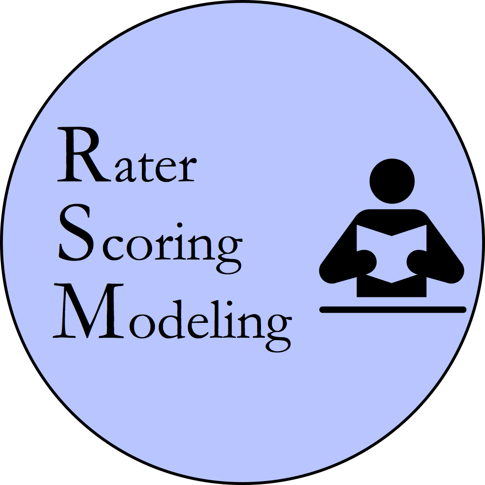

.. RSMTool documentation master file, created by
   sphinx-quickstart on Mon Dec 11 10:52:16 2017.
   You can adapt this file completely to your liking, but it should at least
   contain the root `toctree` directive.

Rater Scoring Modeling Tool (RSMTool)
=====================================

.. container:: clear

    .. image:: assets/spacer.png

Automated scoring of written and spoken responses is a growing field in educational natural language processing. Automated scoring engines employ machine learning models to predict scores for such responses based on features extracted from the text/audio of these responses. Examples of automated scoring engines include `MI Write <https://measurementinc.com/miwrite>`_ for written responses and `SpeechRater <https://www.ets.org/research/topics/as_nlp/speech/>`_ for spoken responses.

RSMTool is a python package which automates and combines in a *single* :doc:`pipeline <pipeline>` multiple analyses that are commonly conducted when building and evaluating automated scoring models. The output of RSMTool is a comprehensive, customizable HTML statistical report that contains the outputs of these multiple analyses. While RSMTool does make it really simple to run this set of standard analyses using a single command, it is also fully customizable and allows users to easily exclude unneeded analyses, modify the standard analyses, and even include custom analyses in the report.

We expect the :doc:`primary users <who>` of RSMTool to be researchers working on developing new automated scoring engines or on improving existing ones. Note that RSMTool is not a scoring engine by itself but rather a tool for building and evaluating machine learning models that may be used in such engines.

The primary means of using RSMTool is via the :doc:`command-line <usage_rsmtool>`.

Documentation
=============

.. note::

   If you use the `Dash <https://kapeli.com/dash>`_ app on macOS, you can also download the complete RSMTool documentation for offline use. Go to the Dash preferences, click on "Downloads", then "User Contributed", and search for "RSMTool".

.. toctree::
   :maxdepth: 2

   who
   pipeline
   evaluation
   getting_started
   tutorial
   usage_rsmtool
   advanced_usage
   custom_notebooks
   automated_configuration
   api
   utilities
   contributing
   internal

Indices and tables
==================

* :ref:`genindex`
* :ref:`modindex`
* :ref:`search`

