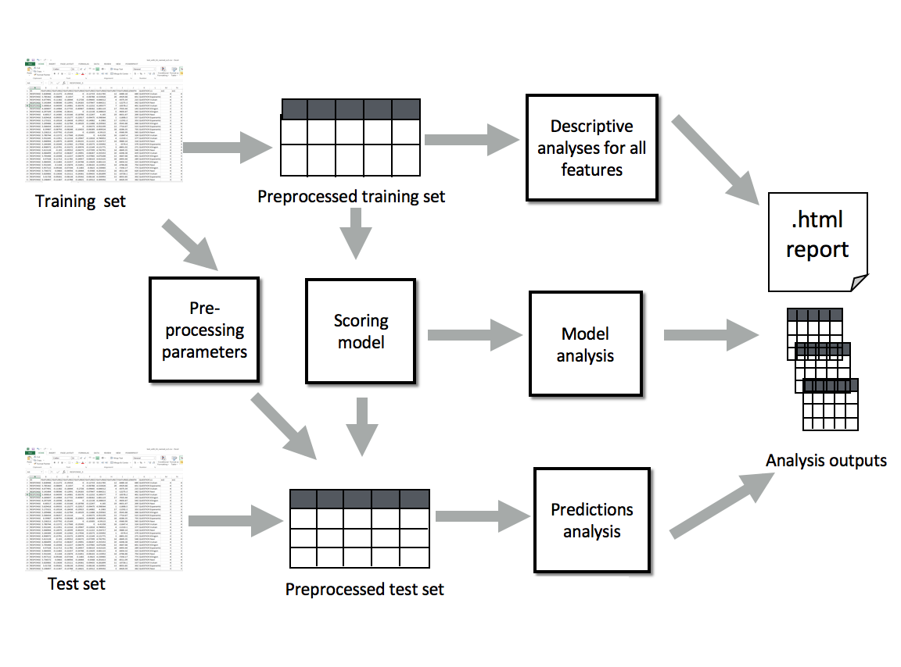

Overview of RSMTool Pipeline
============================

The following figure gives an overview of the RSMTool pipeline:

As its primary input, RSMTool takes a :ref:`data file <input_file_format>` containing a table with numeric, non-sparse features and a human scores for all responses, :ref:`pre-processes <feature_preprocessing>` them and lets you train a regression-based **Scoring Model** to predict the human score from the features. Available regression models include Ridge, SVR, AdaBoost, and Random Forests, among many others.

This trained model can then be used to generate scores for a held-out evaluation data whose feature values are pre-processed using the same :ref:`Pre-processing Parameters <preprocessing_parameters>`. In addition to the raw scores predicted by the model, the **Prediction Analysis** component of the pipline generates several additional :ref:`post-processed scores <score_postprocessing>` that are commonly used in automated scoring.

The primary output of RSMTool is a comprehensive, customizable HTML statistical report that contains the multiple analyses required for a comprehensive evaluation of an automated scoring model including descriptive analyses for all features, model analyses, subgroup comparisons, as well as several different :ref:`evaluation measures <evaluation>` illustrating model efficacy. More Details about these analyses can be found in this documentaion and in a separate `technical paper <https://raw.githubusercontent.com/EducationalTestingService/rsmtool/master/doc/rsmtool.pdf>`_.

In addition to the HTML report, RSMTool also saves the intermediate outputs of all of the performed analyses as :ref:`CSV files <intermediate_files_rsmtool>`.

.. _input_file_format:

Input file format
"""""""""""""""""

The input files for the training and evaluation data should either be in a tabular format with responses as rows and features and score(s) in the columns  in the ``jsonlines`` format with a JSON object per responses on each line. See below for a more detailed description of the ``.jsonlines`` format. 

RSMTool supports input files in ``.csv``, ``.tsv``, ``.sas7bdat``, ``xls``/``.xlsx``, or ``.jsonlines`` format. The format of the file is determined based on the extension. In all cases the :ref:`output files<intermediate_files_rsmtool>` will be saved in ``.csv`` format by default (see :ref:`file format <file_format>` for other intermediate file output options).

For ``Excel`` spreadsheets, all data must be stored in the first sheet. 

In a ``.jsonlines`` format file, each line corresponds to a response and is represented as a dictionary with column names as the keys and column values as the values. For example:

.. literalinclude:: ../tests/data/files/train.jsonlines
   :lines: 1,2

Although RSMTool does allow for nesting in the JSON objects on each line of a ``.jsonlines`` format file, the top-level keys will be ignored when parsing the files and processing the data. Therefore, in the example below, the keys ``x`` and ``metadata`` will be ignored. 

.. literalinclude:: ../tests/data/files/train_nested.jsonlines
   :lines: 1,2

If the file contains nesting of more than two levels, the column names for nested records beyond the top level will be generated using ``.`` to separate levels: For example, given the JSON object ``{'foo': {'bar': {'foo2': 0, 'foo3': 0}}``,  ``foo`` will be ignored and the columns will be named ``bar.foo2`` and ``bar.foo3``.

.. _feature_preprocessing:

Feature pre-processing
""""""""""""""""""""""

Data filtering
~~~~~~~~~~~~~~

1. Remove all training and evaluation responses that have non-numeric for any of the features (see :ref:`column selection methods <column_selection_rsmtool>` for different ways to select features).

2. Remove all training and evaluation responses with non-numeric values for human scores.

3. Optionally remove all training and evaluation responses with zero values for human scores. Zero scored responses are usually removed since in many scoring rubrics, zero scores usually indicate non-scorable responses.

4. Remove all features with values that do not change across responses (i.e., those with a standard deviation close to 0).

Data preprocessing
~~~~~~~~~~~~~~~~~~

1. Truncate/clamp any outlier feature values, where outliers are defined as :math:`\mu \pm 4*\sigma`, where :math:`\mu` is the mean and :math:`\sigma` is the standard deviation.

2. Apply pre-specified :ref:`transformations <feature_list_transformation>` to feature values.

3. Standardize all transformed feature values into *z*-scores.

4. Flip the signs for feature values if necessary.

.. _preprocessing_parameters:

Pre-processing parameters
~~~~~~~~~~~~~~~~~~~~~~~~~
Any held-out evaluation data on which the model is to be evaluated needs to be pre-processed in the same way as the training data. Therefore, the following parameters are computed on the training set, saved to disk, and re-used when pre-processing the evaluation set:

- Mean and standard deviation  of raw feature values. These are used to compute floor and ceiling for truncating any outliers in the evaluation set;

- Any transformation and sign changes that were applied;

- Mean and standard deviation of transformed feature values. These are used to convert feature values in the evaluation set to *z*-scores.

.. _score_postprocessing:

Score post-processing
"""""""""""""""""""""
RSMTool computes six different versions of scores commonly used in different applications of automated scoring:

raw
~~~
The raw predictions generated by the model.

raw_trim
~~~~~~~~
The raw predictions "trimmed" to be in the score range acceptable for the item. The scores are trimmed to be within the following range: :math:`score_{min} - tolerance` and :math:`score_{max} + tolerance`. Unless specified otherwise, :math:`score_{min}` and :math:`score_{max}` are set to the lowest and highest points on the scoring scale respectively and ``tolerance`` is set to 0.4998.

This approach represents a compromise: it provides scores that are real-valued and, therefore, provide more information than human scores that are likely to be integer-valued. However, it also ensures that the scores fall within the expected scale.

.. note::
	In RSMTool v6.x and earlier default ``tolerance`` was set to 0.49998. The ``raw_trim`` values computed by RSMTool for outlier scores starting with v7.0 will be *different* from those computed by earlier versions. You can use the new :ref:`trim_tolerance<trim_tolerance_rsmtool>` field in the configuration file to reproduce old results. 

raw_trim_round
~~~~~~~~~~~~~~
The raw_trim predictions rounded to the nearest integer.

.. note::

    The rounding is done using ``rint`` function from ``numpy``. See `numpy documentation <https://docs.scipy.org/doc/numpy/reference/generated/numpy.around.html#numpy.around>`_ for treatment of values such as 1.5.

scale
~~~~~
The raw predictions rescaled to match the human score distribution on the training set. The raw scores are first converted to *z*-scores using the mean and standard deviation of the *machine scores* predicted for the training set. The *z*-scores are then converted back to "scaled" scores using the mean and standard deviation of the *human scores*, also computed on the training set.

scale_trim
~~~~~~~~~~
The scaled scores trimmed in the same way as raw_trim scores.

scale_trim_round
~~~~~~~~~~~~~~~~
The scale_trim scores scores rounded to the nearest integer.

